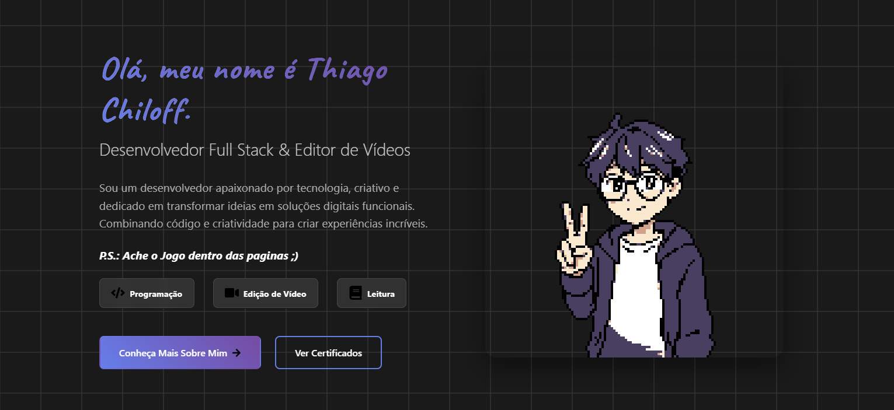

Um portfólio moderno e responsivo desenvolvido com React

Live Demo • Sobre • Tecnologias • Instalação

<strong>

🔗Link
 
https://portifolio-virid-alpha-21.vercel.app/
</strong>

<strong>
📋 Sobre

 

Este é meu portfólio pessoal, uma aplicação web moderna desenvolvida para mostrar minhas habilidades, projetos e certificações. O design é limpo, responsivo e com interações suaves que proporcionam uma ótima experiência do usuário.

 

✨ Características
 
🎨 Design Moderno - Interface limpa e profissional

 

📱 Totalmente Responsivo - Adaptável a todos os dispositivos

 

⚡ Performance Otimizada - Carregamento rápido e eficiente

 

🎯 Navegação Intuitiva - Experiência de usuário fluida
 
🕹️ Seção Interativa - Inclui um jogo desenvolvido com Typescript
 

🛠️ Tecnologias

Frontend 
 

 
Ferramentas 

 

 
🎯 Funcionalidades
 
🏠 Página Inicial
Apresentação pessoal e habilidades

Design acolhedor e convidativo

👤 Sobre Mim
Informações pessoais e profissionais

Hobbies e interesses

 

📜 Certificados
Galeria de certificações e conquistas

Modal de zoom para visualização detalhada

Layout em grid responsivo

 

🎮 Jogo Interativo
Jogo desenvolvido em Typescript

Demonstração de habilidades em programação

Interface divertida e engajante

 

🚀 Instalação
 
Siga estos passos para executar o projeto localmente:

Pré-requisitos
Node.js (versão 14 ou superior)

npm ou yarn

 

📞Contato
 
Thiago Chiloff Murgi de Oliveira
 
📧 Email: chiloffthiago@gmail.com
 
🐙 GitHub: Thiago-Chiloff

</strong>